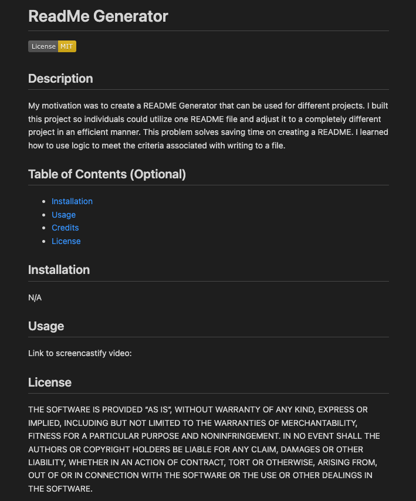

# readme-generator

## Description

My motivation was to create a README Generator that can be used for different projects. I built this project so individuals could utilize one README file and adjust it to a completely different project in an efficient manner. This problem solves saving time on creating a README. I learned how to use logic to meet the criteria associated with writing to a file. 

## Table of Contents (Optional)

- [Installation](#installation)
- [Usage](#usage)
- [Credits](#credits)
- [License](#license)

## Installation

N/A

## Usage

Link to screencastify video: 

## Credits

Isabella Vega - https://github.com/ivega16

## License

## Features

Website

## How to Contribute

Isabella Vega

## Tests

Using VS Code